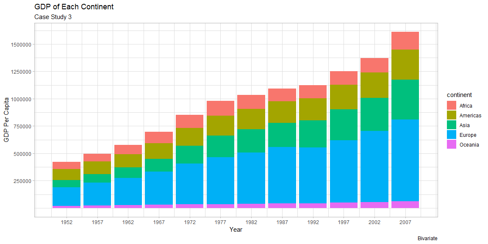
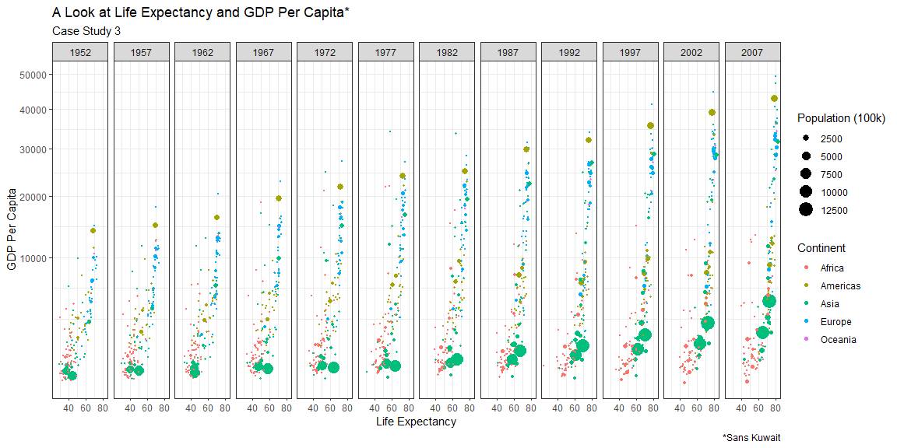

```r
# Use this R-Chunk to import all your datasets!
data <- gapminder
```

## Background

_Place Task Background Here_

## Data Wrangling


```r
# Use this R-Chunk to clean & wrangle your data!

Distinct <- data %>% 
  distinct(country, continent) %>% 
  group_by(continent) %>% 
  count(continent)

names(Distinct) = c("Continent", "CountryCount")

Distinct
```

```
## # A tibble: 5 x 2
## # Groups:   Continent [5]
##   Continent CountryCount
##   <fct>            <int>
## 1 Africa              52
## 2 Americas            25
## 3 Asia                33
## 4 Europe              30
## 5 Oceania              2
```

```r
PopYear <- data %>% 
  group_by(year) 

PopYear <- aggregate(PopYear$pop, by=list(year=PopYear$year), FUN=sum)
  
names(PopYear) = c("Year", "Population")

PopYear
```

```
##    Year Population
## 1  1952 2406957150
## 2  1957 2664404580
## 3  1962 2899782974
## 4  1967 3217478384
## 5  1972 3576977158
## 6  1977 3930045807
## 7  1982 4289436840
## 8  1987 4691477418
## 9  1992 5110710260
## 10 1997 5515204472
## 11 2002 5886977579
## 12 2007 6251013179
```

```r
NoKU <- data %>% 
  filter(country != 'Kuwait')

NoKU
```

```
## # A tibble: 1,692 x 6
##    country     continent  year lifeExp      pop gdpPercap
##    <fct>       <fct>     <int>   <dbl>    <int>     <dbl>
##  1 Afghanistan Asia       1952    28.8  8425333      779.
##  2 Afghanistan Asia       1957    30.3  9240934      821.
##  3 Afghanistan Asia       1962    32.0 10267083      853.
##  4 Afghanistan Asia       1967    34.0 11537966      836.
##  5 Afghanistan Asia       1972    36.1 13079460      740.
##  6 Afghanistan Asia       1977    38.4 14880372      786.
##  7 Afghanistan Asia       1982    39.9 12881816      978.
##  8 Afghanistan Asia       1987    40.8 13867957      852.
##  9 Afghanistan Asia       1992    41.7 16317921      649.
## 10 Afghanistan Asia       1997    41.8 22227415      635.
## # ... with 1,682 more rows
```

## Data Visualization


```r
# Use this R-Chunk to plot & visualize your data!

## Qualitative
G1 <- ggplot(data = Distinct,
             mapping = aes(x = Continent,
                           y = CountryCount,
                           fill = Continent)) +
  geom_col() +
  theme_bw()+
  labs(x = 'Continent',
       y = 'Number of Countries',
       title = 'Number of Countries Per Continent',
       subtitle = 'Case Study 3',
       caption = 'Qualitative')

G1
```

<!-- -->

```r
G1Save <- ggsave("G1.png", width = 15, units = "in")


## Quantitative
G2 <- ggplot(data = PopYear,
             mapping = aes(x = Year,
                           y = Population)) +
  geom_line() +
  geom_point() +
  scale_x_continuous(breaks = c(1952, 1957, 1962, 1967, 1972, 1977, 1982, 1987, 1992, 1997, 2002, 2007)) +
  scale_y_continuous(breaks = c(3000000000, 4000000000, 5000000000, 6000000000), labels = c(3, 4, 5, 6)) +
  labs(y = "Population (Billion)",
       x = "Year",
       title = "World Population per Year",
       subtitle = "Case Study 3",
       caption = 'Quantitative') +
  theme_light()
  

G2
```

<!-- -->

```r
G2Save <- ggsave("G2.png", width = 15, units = "in")


#Bivariate
G3 <- ggplot(data = NoKU,
             mapping = aes(x = year,
                           y = gdpPercap,
                           fill = continent)) +
  
  geom_col() +
  labs(x = 'Year',
       y = 'GDP Per Capita',
       title = 'GDP of Each Continent',
       subtitle = 'Case Study 3',
       caption = 'Bivariate' ) +
  scale_x_continuous(breaks = c(1952, 1957, 1962, 1967, 1972, 1977, 1982, 1987, 1992, 1997, 2002, 2007)) +
  scale_y_continuous(breaks = c(250000, 500000, 750000, 1000000, 1250000, 1500000)) +
  theme_light()
               
G3
```

<!-- -->

```r
G3Save <- ggsave("G3.png", width = 15, units = "in")

## Life Exp vs. GDP
G4 <- ggplot(data = NoKU,
       mapping = aes(x = lifeExp,
                     y = gdpPercap,
                     color = continent,
                     size = pop)) +
  scale_y_continuous(trans = "sqrt") +
  theme_bw() +
  geom_point() +
  facet_wrap(~year, nrow = 1) +
  #Labels
  labs(x = "Life Expectancy",
                y = "GDP Per Capita",
                title = "A Look at Life Expectancy and GDP Per Capita*",
                subtitle = "Case Study 3",
                caption = "*Sans Kuwait",
                color = "Continent",
                size = "Population (100k)") +
  scale_size_area(breaks = c(250000000,500000000,750000000,1000000000,1250000000), labels = c(2500, 5000, 7500, 10000, 12500))

G4
```

<!-- -->

```r
G4Save <- ggsave("G4.png", width = 15, units = "in")
```

## Expanation of Graphs 1,2,& 3
The first graph is showing how many countries per continent. For this I had to learn the distinct function in order to find the unique names from the dataframe. In the second graph, I learned the aggregate function in order to add together each of the populations from each country each year. The third graph is looking at Global GDP broken down by continent.
