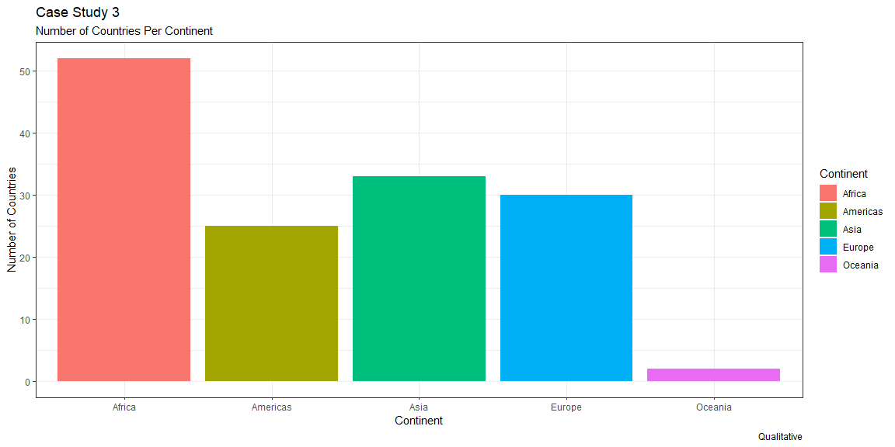
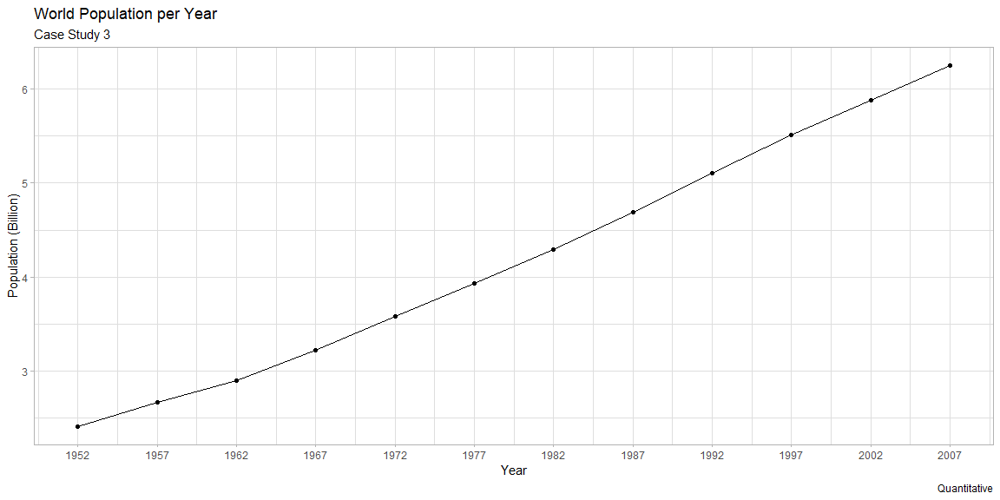

```r
# Use this R-Chunk to import all your datasets!
data <- gapminder
```

## Background

_Place Task Background Here_

## Data Wrangling


```r
# Use this R-Chunk to clean & wrangle your data!


Distinct <- data %>% 
  distinct(country, continent) %>% 
  group_by(continent) %>% 
  count(continent)

names(Distinct) = c("Continent", "CountryCount")

Distinct
```

```
## # A tibble: 5 x 2
## # Groups:   Continent [5]
##   Continent CountryCount
##   <fct>            <int>
## 1 Africa              52
## 2 Americas            25
## 3 Asia                33
## 4 Europe              30
## 5 Oceania              2
```

```r
NoKU <- data %>% 
  filter(country != 'Kuwait')

NoKU
```

```
## # A tibble: 1,692 x 6
##    country     continent  year lifeExp      pop gdpPercap
##    <fct>       <fct>     <int>   <dbl>    <int>     <dbl>
##  1 Afghanistan Asia       1952    28.8  8425333      779.
##  2 Afghanistan Asia       1957    30.3  9240934      821.
##  3 Afghanistan Asia       1962    32.0 10267083      853.
##  4 Afghanistan Asia       1967    34.0 11537966      836.
##  5 Afghanistan Asia       1972    36.1 13079460      740.
##  6 Afghanistan Asia       1977    38.4 14880372      786.
##  7 Afghanistan Asia       1982    39.9 12881816      978.
##  8 Afghanistan Asia       1987    40.8 13867957      852.
##  9 Afghanistan Asia       1992    41.7 16317921      649.
## 10 Afghanistan Asia       1997    41.8 22227415      635.
## # ... with 1,682 more rows
```

## Data Visualization


```r
# Use this R-Chunk to plot & visualize your data!
G1 <- ggplot(data = Distinct,
             mapping = aes(x = Continent,
                           y = CountryCount,
                           fill = Continent)) +
  geom_col() +
  theme_bw()+
  labs(x = 'Continent',
       y = 'Number of Countries',
       title = 'Case Study 3',
       subtitle = 'Number of Countries Per Continent',
       caption = 'Qualitative')

G1
```

<!-- -->

```r
G1Save <- ggsave("G1.png", width = 15, units = "in")
#Base Graph
G3 <- ggplot(data = NoKU,
       mapping = aes(x = lifeExp,
                     y = gdpPercap,
                     color = continent,
                     size = pop)) +
  scale_y_continuous(trans = "sqrt") +
  theme_bw() +
  geom_point() +
  facet_wrap(~year, nrow = 1) +
  #Labels
  labs(x = "Life Expectancy",
                y = "GDP Per Capita",
                title = "Case Study 3",
                subtitle = "A Look at Life Expectancy and GDP Per Capita*",
                caption = "*Sans Kuwait",
                color = "Continent",
                size = "Population (100k)") 

G3
```

<!-- -->

```r
G3 <- G3 + scale_fill_binned(breaks = c(2.50e+08, 5.00e+08, 7.50e+08, 1.00e+09, 1.25e+09), labels = c(2500, 5000, 7500, 10000, 12500))


G3Save <- ggsave("G3.png", width = 15, units = "in")
```

## Conclusions
