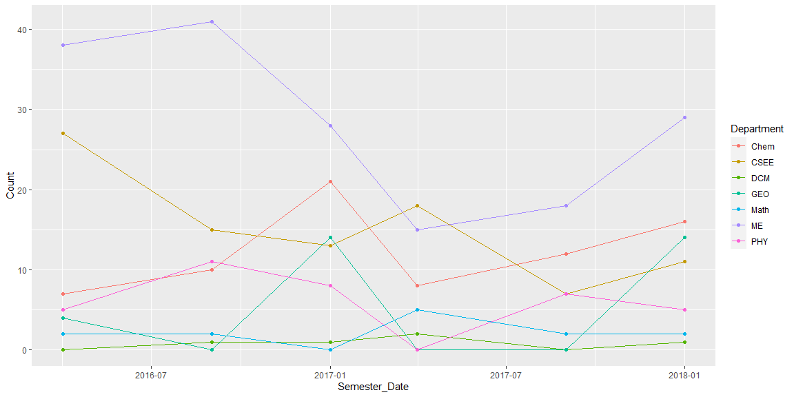
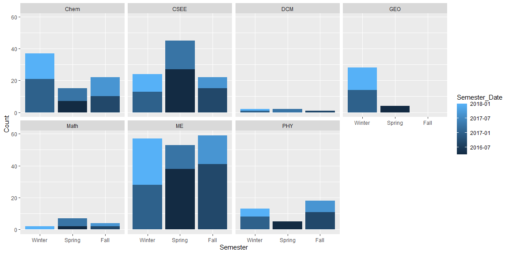

```r
# Use this R-Chunk to import all your datasets!
rcw <- read_csv("https://byuistats.github.io/M335/data/rcw.csv", #Pulling in the csv to use.
                col_types = cols(Semester_Date = col_date(format = "%m/%d/%y"), #
                                 Semester = col_factor(levels = c("Winter", "Spring", "Fall"))))
```

## Background

_Place Task Background Here_

## Data Wrangling


```r
# Use this R-Chunk to clean & wrangle your data!
head(rcw) #Shows the first few rows of each column of the dataset rcw
```

```
## # A tibble: 6 x 5
##    Year Semester Semester_Date Count Department
##   <dbl> <fct>    <date>        <dbl> <chr>     
## 1  2016 Spring   2016-04-01        7 Chem      
## 2  2016 Fall     2016-09-01       10 Chem      
## 3  2017 Winter   2017-01-01       21 Chem      
## 4  2017 Spring   2017-04-01        8 Chem      
## 5  2017 Fall     2017-09-01       12 Chem      
## 6  2018 Winter   2018-01-01       16 Chem
```

## Data Visualization


```r
# Use this R-Chunk to plot & visualize your data!
ggplot(data = rcw, 
       mapping = aes(x = Semester_Date, 
                     y = Count, 
                     color = Department)) +
  geom_line() +
  geom_point()    #line graph using the dataset rcw showing 'semester_date' on the x-axis and 'count' on the y-axis. The color of the graph is depicting what 'department' is shown.
```

<!-- -->

```r
                  #geom_point is adding points to the graph


#Facet Wrap
ggplot(data = rcw,
       mapping = aes(x = Semester,
                     y = Count,
                     fill = Semester_Date)) +
  geom_bar(stat = 'identity') +
  facet_wrap(~Department, ncol = 4)
```

<!-- -->

## Conclusions
